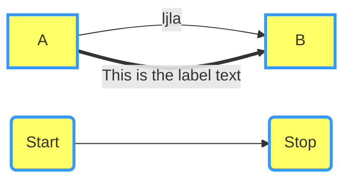

# Linux命令行常用命令

命令|使用|描述
-|-|-
file| |
find|
locate| |
head||
tail||
sort||
man||
info||
ls||
tar||
zcat||
iptable||
route||
lsof||
lscpu||
netstat||

## Linux目录结构


```mermaid
  
graph TB
    classDef node fill:#FFFF66,stroke:#3399FF,stroke-width:3px
A(Apple)==>B{Boy}
A===C(Cat)
B.->D((Dog))
C==喵==>D
style A fill:#aa2
```


 